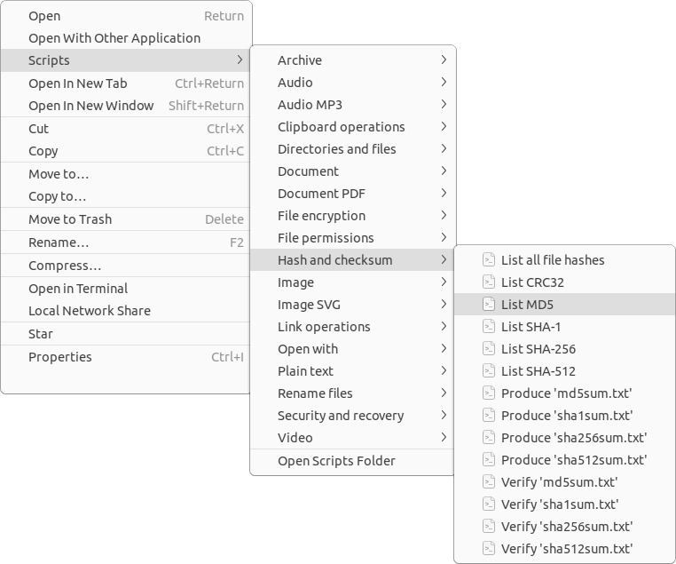

# Enhanced File Manager Actions for Linux

This project offers a collection of file manager actions, also known as Nautilus Scripts, meticulously crafted to enrich the functionality of file managers. With intuitive right-click actions on files and directories, it enhances the user experience seamlessly.

Compatible with file managers:

- [GNOME Files (Nautilus)](https://gitlab.gnome.org/GNOME/nautilus)
- [Caja](https://github.com/mate-desktop/caja)
- [Dolphin](https://github.com/KDE/dolphin)
- [Nemo](https://github.com/linuxmint/nemo)
- [PCManFM-Qt](https://github.com/lxqt/pcmanfm-qt)
- [Thunar](https://gitlab.xfce.org/xfce/thunar)



## Installing

To install, just run the following command in the terminal:

```sh
bash install.sh
```

## Advantages

While numerous scripts are available for file managers on the web, many suffer from poor functionality, lack of error checking, and dependency management. Some scripts only work with files that don't have special characters in their names, among other limitations. To address these shortcomings, I have developed my own set of scripts, which offer the following advantages:

- **Parallel task execution**: Processes multiple files simultaneously. Very fast!
- **Progress dialog**: Displays a progress dialog and allows interruption of tasks at any time.
- **Status notifications**: Notifies users of dependency errors and MIME types.
- **Dependency management**: Prompts users to install any missing dependencies.
- **Remote file support:** Works with files stored on remote servers.
- **Non-destructive output**: Never overwrites the input file; the output is distinct.
- **Log file**: Produces an `Errors.log` file when a task ends with an error.
- **Direct usage**: Direct usage without requiring input parameters.
- **Keyboard shortcuts**: Provides keyboard shortcuts for the scripts.
- **File manager compatibility**: Designed for major file managers like GNOME Files (Nautilus), Dolphin, Caja, Nemo and Thunar.
- **Distro compatibility**: Designed to work on major GNU/Linux distributions, such as Ubuntu, Mint, Debian, Fedora, and Manjaro.
- **Easy adaptation**: Scripts can be easily copied and adapted for other purposes.
- **Bash implementation**: All scripts are implemented in Bash. So, the scripts work well in the shell (without a graphical interface) and file managers.
- **Shell script validation**: All scripts have been checked using [ShellCheck](https://github.com/koalaman/shellcheck).
- **Easy access to recent scripts**: Includes a menu, `Accessed recently`, to quickly access recently used scripts, saving time and streamlining workflows.

## Keyboard Shortcuts

| Key                 | Action                        |
| ------------------- | ----------------------------- |
| `F3`                | Code Editor                   |
| `F4`                | Terminal                      |
| `F7`                | Disk Usage Analyzer           |
| `<Control>E`        | Extract Here                  |
| `<Control><Alt>C`   | Compress...                   |
| `<Control><Alt>G`   | Compress to 'tar.gz' (each)   |
| `<Control><Alt>S`   | Compress to 'tar.zst' (each)  |
| `<Control><Alt>V`   | Paste as hard link            |
| `<Control><Alt>X`   | Compress to 'tar.xz' (each)   |
| `<Control><Alt>Z`   | Compress to 'zip' (each)      |
| `<Control><Shift>C` | Compare items                 |
| `<Control><Shift>E` | List empty directories        |
| `<Control><Shift>G` | Git clone (URLs in clipboard) |
| `<Control><Shift>H` | List hidden items             |
| `<Control><Shift>O` | Open item location            |
| `<Control><Shift>P` | List permissions and owners   |
| `<Control><Shift>U` | List duplicate files          |
| `<Control><Shift>V` | Paste as symbolic link        |
| `<Control><Shift>X` | Download (URLs in clipboard)  |
| `<Control><Shift>Y` | List file information         |
| `<Control><Alt>1`   | List file mime                |
| `<Control><Alt>2`   | List files issues             |
| `<Control><Alt>3`   | List files with bad chars     |
| `<Control><Alt>4`   | List encodings                |
| `<Control><Alt>5`   | List line breaks              |
| `<Control><Alt>6`   | List lines count              |
| `<Control><Alt>7`   | List max line length          |
| `<Control><Alt>8`   | List words count              |
| `<Control><Alt>9`   | List largest directories      |
| `<Control><Alt>0`   | List largest files            |

## Compatibility

File managers compatibility:

| File manager           | Environment | Menu integration | Menu "Accessed recently" | Keyboard shortcuts |
| ---------------------- | ----------- | ---------------- | ------------------------ | ------------------ |
| GNOME Files (Nautilus) | GNOME       | Yes              | Yes                      | Yes                |
| Caja                   | MATE        | Yes              | Yes                      | Yes                |
| Nemo                   | Cinnamon    | Yes              | Yes                      | Yes                |
| Dolphin                | KDE Plasma  | Yes              | No                       | No                 |
| PCManFM-Qt             | LXQt        | Yes              | No                       | No                 |
| Thunar                 | Xfce        | Yes              | No                       | Yes                |

Most scripts have been tested on the following GNU/Linux distributions:

- Ubuntu 18.04, 20.04, 22.04, 24.04, 24.10
- Debian 12 (Gnome and KDE)
- Fedora Workstation 39, 40, 41
- EndeavourOS 2024
- KDE neon 2024
- Kubuntu 22.04, 24.04
- Lubuntu 22.04, 24.04
- Manjaro 23, 24 (Gnome)
- Mint 21, 22 (Cinnamon, MATE and Xfce)
- openSUSE Tumbleweed 2024 (Gnome)
- Xubuntu 23.10, 24.04
- Zorin OS Core 17.1

## Handling Large Input Lists

This project includes a functionality specifically designed to manage scenarios where input lists are too large for processing (e.g., 100,000 input files). Excessively large input lists can lead to errors like:

`Could not start application: Failed to execute child process "/bin/sh" (Argument list too long)`

In some cases, the scripts may fail to run. To avoid such issues, follow these steps:

1. Create a single directory with a name that includes the word `batch`;
2. Place all the files you want to process into this directory.
3. Execute the desired script in this directory.

The scripts will automatically recognize the batch directory as a special input and process all the files it contains. This method prevents errors caused by excessively large argument lists and ensures efficient execution.

## Contributing

If you spot a bug or want to improve the code or even improve the content, you can do the following:

- [Open an issue](https://github.com/cfgnunes/nautilus-scripts/issues/new)
  describing the bug or feature idea;
- Fork the project, make changes, and submit a pull request.
