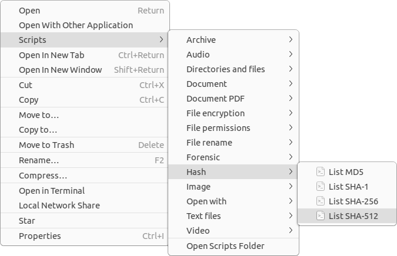

# Nautilus scripts

This is a collection of scripts designed to enhance the functionality of file managers such as [GNOME Files](https://gitlab.gnome.org/GNOME/nautilus), [Caja](https://github.com/mate-desktop/caja), and [Nemo](https://github.com/linuxmint/nemo).



While numerous scripts are available for GNOME Files on the web, many suffer from poor functionality, lack of error checking, and dependency management. Some scripts only work with files that don't have spaces in their names, among other limitations. To address these shortcomings, I have developed my own set of scripts, which offer the following advantages:

- **Parallel task execution**: Processes multiple files simultaneously.
- **Progress dialog**: Displays a progress dialog and allows interruption of tasks at any time.
- **Status notifications**: Notifies users of dependency errors and MIME types.
- **Dependency management**: Prompts users to install any missing dependencies.
- **Non-destructive output**: Never overwrites the input file; the output is distinct.
- **Log file**: Produces an `Errors.log` file when a task ends with an error.
- **Direct usage**: Enables direct usage without requiring input parameters.
- **Keyboard shortcuts**: Provides keyboard shortcuts for the scripts.
- **File manager compatibility**: Designed for major file managers like Nautilus, Caja, and Nemo.
- **Distro compatibility**: Designed to work on major Linux distributions, such as Ubuntu, Mint, Debian, Fedora, and Manjaro.
- **Easy adaptation**: Scripts are easily copied and adapted for other purposes.
- **Bash implementation**: All scripts are implemented in Bash.
- **Shell script validation**: All scripts have been checked using [ShellCheck](https://github.com/koalaman/shellcheck).

## Keyboard Shortcuts

| Key                      | Action                        |
| ------------------------ | ----------------------------- |
| `F3`                     | Code Editor                   |
| `F4`                     | Terminal                      |
| `F7`                     | Disk Usage Analyzer           |
| `<Control>E`             | Extract Here                  |
| `<Control>K`             | Compress...                   |
| `<Shift><Control>A`      | List all files                |
| `<Shift><Control>D`      | List duplicate files          |
| `<Shift><Control>E`      | List empty directories        |
| `<Shift><Control>H`      | List hidden items             |
| `<Shift><Control>L`      | Make a link (symbolic link)   |
| `<Shift><Control>M`      | Compare with Meld             |
| `<Shift><Control>O`      | Open item location            |
| `<Shift><Control>P`      | List permissions and owners   |
| `<Shift><Control>Y`      | List file type                |
| `<Shift><Control><Alt>D` | Download (URLs in clipboard)  |
| `<Shift><Control><Alt>G` | Git clone (URLs in clipboard) |

## Installing

To install in GNOME Files (Nautilus), Caja, or Nemo, just run the following command in the terminal:

```sh
bash install.sh
```

## Known issues

- It doesn't support a long list of input files (Argument list too long).

## Contributing

If you spot a bug or want to improve the code or even improve the content, you can do the following:

- [Open an issue](https://github.com/cfgnunes/nautilus-scripts/issues/new)
  describing the bug or feature idea;
- Fork the project, make changes, and submit a pull request.
